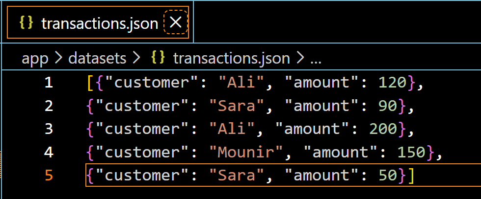
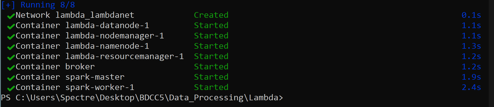
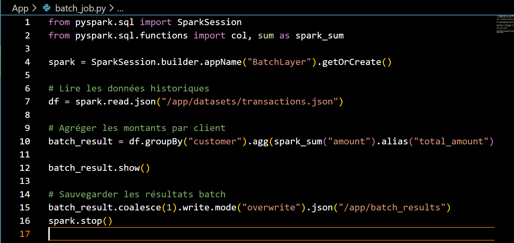
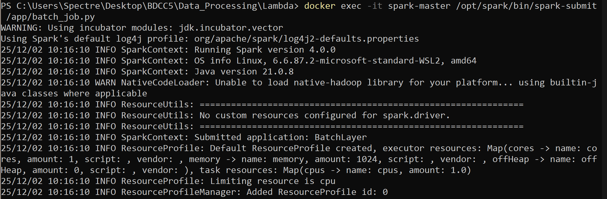
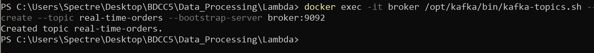
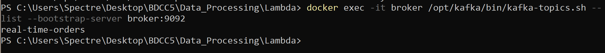
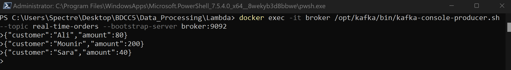
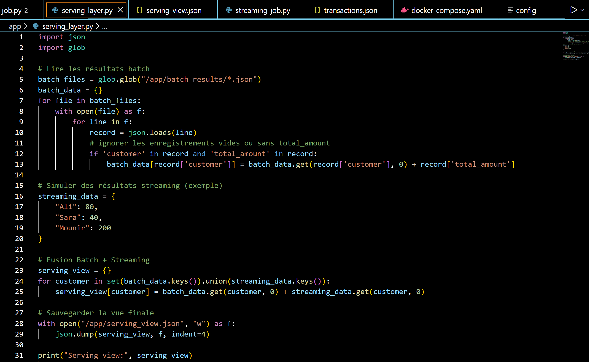
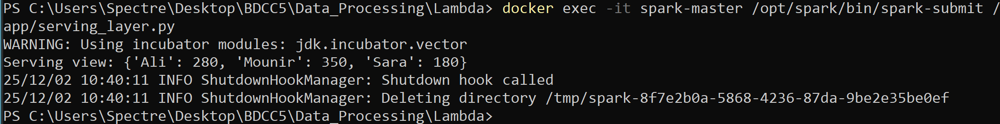
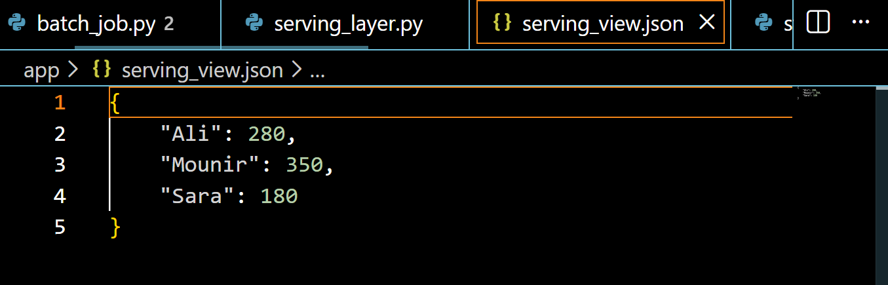

# Atelier Lambda : Spark + Kafka

## 1. Objectifs de l’atelier
- Implémenter un traitement batch avec Spark pour calculer des agrégations sur des données historiques.  
- Implémenter un traitement streaming avec Spark Structured Streaming à partir d’un topic Kafka.  

## 2. Structure du projet

```

atelier-lambda/
├─ docker-compose.yml
├─ app/
│  ├─ datasets/
│  │  └─ transactions.json
│  ├─ batch_job.py
│  ├─ streaming_job.py
│  └─ serving_layer.py
├─ images/

````

## 3. Dataset utilisé

Fichier : `app/datasets/transactions.json`




Ce dataset représente des transactions simples : un client et un montant.

## 4. Mise en place de l’environnement (Docker Compose)

Fichier : `docker-compose.yml`

Pour démarrer les services :

```bash
docker compose up -d
```


Vérifier que les conteneurs tournent :

```bash
docker ps
```

## 5. Batch Layer – Traitement des données historiques

**Fichier :** `app/batch_job.py`



**Objectif pédagogique :**

* Comprendre le rôle de la Batch Layer.
* Lire des données historiques et produire une vue agrégée.

**Exécution :**



## 6. Speed Layer – Traitement en temps réel avec Kafka + Spark Streaming

### 6.1 Création du topic Kafka



Vérification :




### 6.2 Producteur Kafka

Pour envoyer des événements en temps réel :



### 6.3 Spark Streaming Job

**Fichier :** `app/streaming_job.py`


**Exécution :**


## 7. Serving Layer – Fusion Batch + Streaming

**Fichier :** `app/serving_layer.py`



Objectif pédagogique :

* Montrer le rôle de la Serving Layer.
* Combiner précision (batch) et réactivité (streaming).

## 8. Resultat





